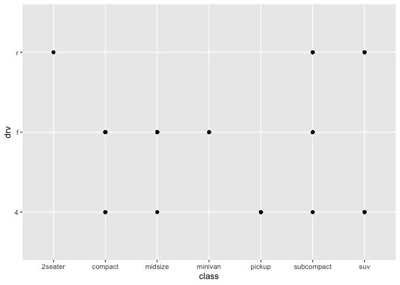

3.2.4.1

I see nothing in the plot, it's blank.
3.2.4.2
There are 10 rows and 11 columns in mpg.
3.2.4.3
Drv is the type of drive train, where r = front-wheel drive, 4 = 4wd.
3.2.4.4

```r
ggplot(data = mpg) + geom_point(mapping = aes(x = hwy, y = cyl))
```

<!-- -->
3.2.4.5

```r
ggplot(data = mpg) + geom_point(mapping = aes(x = class, y = drv))
```

<!-- -->
Because drv describes the type of train while class describes "type" of car, which is unrelated and the scatters are discrete.
3.3.1.1
Because the parenthesis is placed in the wrong places. It should be

```r
ggplot(data = mpg) + geom_point(mapping = aes(x = displ, y = hwy), color = "blue")
```

<!-- -->
3.3.1.2
Manufacture, model, trans, drv, fl, and class are categorical. And displ, cyl, cty, and hwy are continous.
3.3.1.3

```r
ggplot(data = mpg) + geom_point(mapping = aes(x = displ, y = hwy, color = cyl))
```

<!-- -->

```r
ggplot(data = mpg) + geom_point(mapping = aes(x = displ, y = hwy, size = cyl))
```

<!-- -->
For the color, there is only one type of color like blue. According to the data, the color turns lighter or darker.
For the size, it's similar but in continuous variable, the smaller size refers to smaller amount of number.
For the shape one, there's no plot for continuous variable.
3.3.1.4

```r
ggplot(data = mpg) + geom_point(mapping = aes(x = displ, y = hwy, color = class, shape = class))
```

```
## Warning: The shape palette can deal with a maximum of 6 discrete values because
## more than 6 becomes difficult to discriminate; you have 7. Consider
## specifying shapes manually if you must have them.
```

```
## Warning: Removed 62 rows containing missing values (geom_point).
```

<!-- -->
It will have different color and shape for a type of category of the variable.
3.3.1.5
The stroke is controlled by the stroke, and the size of the filled part is controlled by size. The total size of the point is the sume of these two.
3.3.1.6

```r
ggplot(data = mpg) + geom_point(mapping = aes(x = displ, y = hwy, colour = displ < 5))
```

<!-- -->
The points are catagorized into two color by whether displ is smaller than 5 or not.
3.5.1.1

```r
ggplot(data = mpg) + geom_point(mapping = aes(x = displ, y = hwy)) + facet_wrap(~ cty)
```

<!-- -->
It will have facets according to the number of continuous variable as each number has its own facet.
3.5.1.2
It means there's no point existing at those facets, and the there's no number in that range.

```r
ggplot(data = mpg) + geom_point(mapping = aes(x = drv, y = cyl))
```

<!-- -->
They are not related closely because variables are different.
3.5.1.3

```r
ggplot(data = mpg) + geom_point(mapping = aes(x = displ, y = hwy)) + facet_grid(drv ~ .)
```

<!-- -->

```r
ggplot(data = mpg) + geom_point(mapping = aes(x = displ, y = hwy)) + facet_grid(. ~ cyl)
```

<!-- -->
. may refer to whether x or y direction will be turned into facets.
3.5.1.4

```r
ggplot(data = mpg) + geom_point(mapping = aes(x = displ, y = hwy)) + facet_wrap(~ class, nrow = 2)
```

<!-- -->
The advantage is that we can observe more clearly on the data. The disadvantage is that colour aesthetic can see the trend of the data comprehensively.
3.5.1.5
nrow is the number of rows, and ncol is the number of columns. dir also controls the layout of the individual panel. Because facet_wrap faets on one variable, so facet_grid doesn't have nrow and ncol.
3.5.1.6
Because if the variable has more levels, it will facet into smaller part for the axie, which will cause the plot hard to observe.
3.6.1.1
line chart: geom_line()
boxplot: geom_boxplot()
histogram: geom_histogram()
area: geom_area()
3.6.1.2
It has both points and a smooth line.

```r
ggplot(data = mpg, mapping = aes(x = displ, y = hwy, color = drv)) + geom_point() + geom_smooth(se = FALSE)
```

```
## `geom_smooth()` using method = 'loess' and formula 'y ~ x'
```

<!-- -->
3.6.1.3

```r
ggplot(data = mpg) + geom_smooth(mapping = aes(x = displ, y = hwy, color = drv))
```

```
## `geom_smooth()` using method = 'loess' and formula 'y ~ x'
```

<!-- -->
It will give you a clearer plot that shows what the specific variable is.
3.6.1.4
se displays the confidence interval around the smooth.
3.6.1.5

```r
ggplot(data = mpg, mapping = aes(x = displ, y = hwy)) + geom_point() + geom_smooth()
```

```
## `geom_smooth()` using method = 'loess' and formula 'y ~ x'
```

<!-- -->

```r
ggplot() + geom_point(data = mpg, mapping = aes(x = displ, y = hwy)) + geom_smooth(data = mpg, mapping = aes(x = displ, y = hwy))
```

```
## `geom_smooth()` using method = 'loess' and formula 'y ~ x'
```

<!-- -->
There's no difference because the axes and geom all refer to the same thing.
3.6.1.6

```r
ggplot(data = mpg, mapping = aes(x = displ, y = hwy)) + geom_point(mapping = aes(color = drv)) + geom_smooth()
```

```
## `geom_smooth()` using method = 'loess' and formula 'y ~ x'
```

<!-- -->
The forth one.
